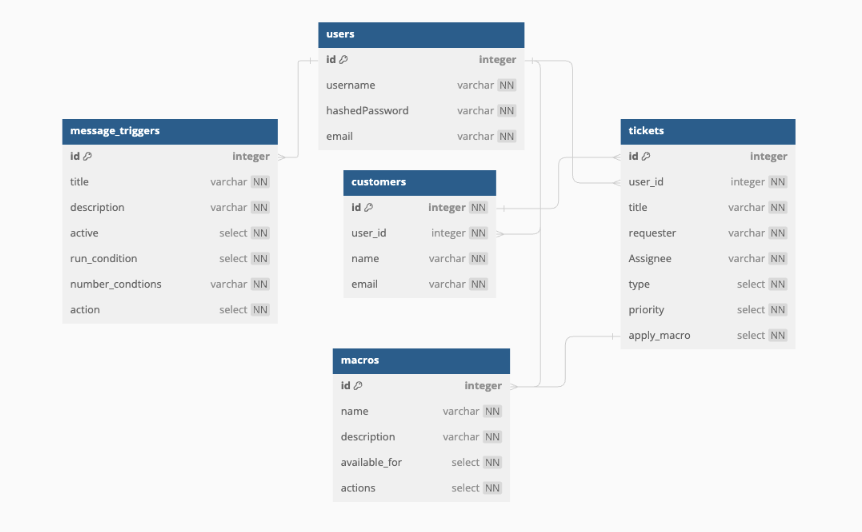

Backend Routes
Table users { //employee
  id integer [primary key]
  username varchar [not null, unique]
  hashedPassword varchar [not null]
  email varchar [not null, unique]
}

Table customers {
  id integer [primary key, not null, ref: < tickets.id]
  user_id integer [not null, ref: > users.id]
  name varchar [not null]
  email varchar [not null]
}

Table tickets {
  id integer [primary key]
  user_id integer [not null, ref: > users.id]
  title varchar [not null]
  requester varchar [not null]
  Assignee varchar [not null]
  type select [not null]
  priority select [not null]
  apply_macro select [not null, ref: < macros.id] 
}

Table macros {
   id integer [primary key, ref: > users.id]
   name varchar [not null]
   description varchar [not null]
   available_for select [not null]
   actions select [not null]
}

Table message_triggers { //shown in sent-box when ticket closed or customer deleted
  id integer [primary key, ref: > users.id]
  title varchar [not null]
  description varchar [not null]
  active select [not null]
  run_condition select [not null]
  number_condtions varchar [not null]
  action select [not null]
}
<!-- Users

GET /api/users/

Returns the information for all users
GET /api/users/:id

Returns the information for one user
Sessions

GET /api/auth/

Returns the information for the logged in user
POST /api/auth/signup

Signs a new user up
POST /api/auth/login

Logs in a user
DELETE /api/auth/

Logs out a user
Systems

GET /api/systems/

Returns the information for all systems
POST /api/systems/

Creates a new system
GET /api/systems/:id

Returns the information for one system
DELETE /api/systems/:id

Deletes a system
Characters

GET /api/characters/

Returns the information for all characters
POST /api/characters/

Creates a new character
GET /api/characters/:id

Returns the information for one character
PUT /api/characters/:id

Edits the information for one character
DELETE /api/characters/:id

Deletes a character
POST /api/characters/:id/comments/

Creates a new comment for a specific character
Comments

PUT /api/comments/:id

Edits a comment
DELETE /api/comments/:id

Deletes a comment
Images

POST /api/images/

Creates a new image
DELETE /api/images/:id

Deletes an image -->